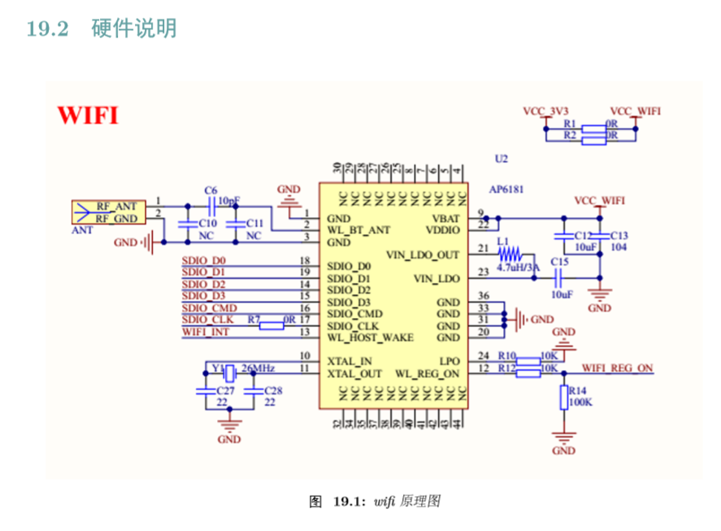
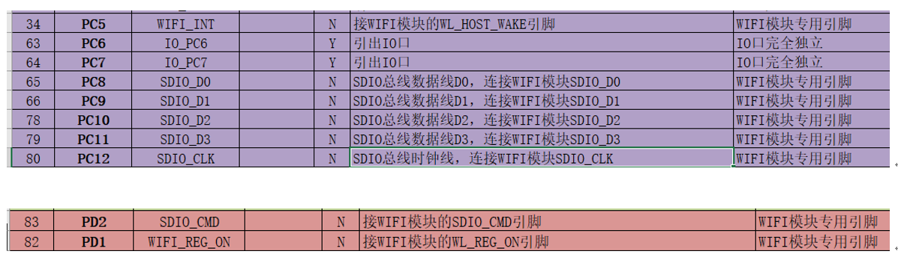
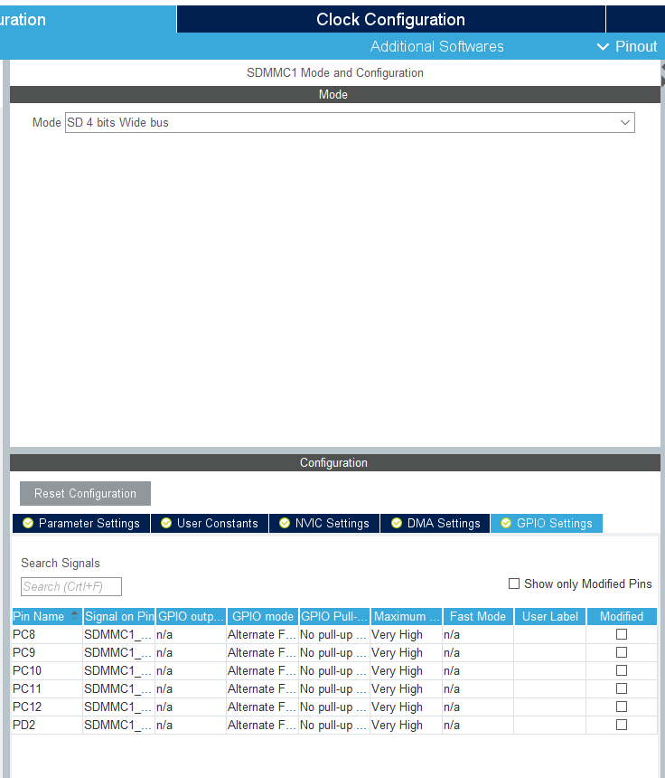
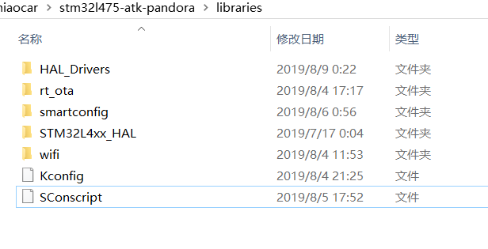
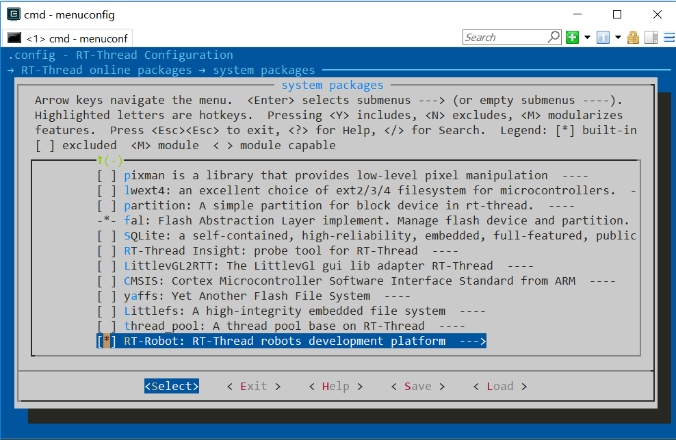

# 实现遥控器控制

## 简介

本文档为智能战车实现遥控器控制说明 ，主要基于潘多拉板子上的 WIFI 控制 。

主要内容如下：

- 板子上 WIFI 驱动环境配置 ，添加及测试
- 控制命令代码配置说明 
- 注意事项

通过阅读以下内容可以快速基于 WIFI 控制智能小车，方便快速上手测试。

## 板载 WIFI 驱动添加

潘多拉 STM32L475 是正点原子推出的一款基于 ARM Cortex-M4 内核的开发板，最高主频为 80Mhz，该开发板具有丰富的板载资源，可以充分发挥 STM32L475 的芯片性能， 其WIFI 模块使用的是（AP6181）使用 SDIO 2.0接口 。

WIFI 驱动添加涉及内容包括配置相关 WIFI 配置引脚及使能 ，W25Q128 相关引脚及功能 ，Kconfig 配置文件修改及相关功能使能 ,建议直接使用目前的移植好代码就可以。

开发板 WIFI 部分原理图如下图所示：





### CubeMX_Config **引脚配置** 如下：



### 修改board.h
当时就是这里出错导致烧录去无法运行 。为什么要这么配置 ，可能涉及WiFi驱动库有关 。
```
#ifdef __ICCARM__
// Use *.icf ram symbal, to avoid hardcode.
extern char __ICFEDIT_region_IRAM1_end__;
#define STM32_SRAM_END          &__ICFEDIT_region_IRAM1_end__
#else
#define STM32_SRAM_SIZE         96
#define STM32_SRAM_END          (0x20000000 + STM32_SRAM_SIZE * 1024)
#endif
#ifdef __CC_ARM
extern int Image$$RW_IRAM1$$ZI$$Limit;
#define HEAP_BEGIN    (&Image$$RW_IRAM1$$ZI$$Limit)
#elif __ICCARM__
#pragma section="HEAP"
#define HEAP_BEGIN    (__segment_end("HEAP"))
#else
extern int __bss_end;
#define HEAP_BEGIN    (&__bss_end)
#endif

#define HEAP_END                STM32_SRAM_END
#define STM32_SRAM2_SIZE        32
#define STM32_SRAM2_BEGIN       (0x10000000u)
#define STM32_SRAM2_END         (0x10000000 + STM32_SRAM2_SIZE * 1024)
#define STM32_SRAM2_HEAP_SIZE   ((uint32_t)STM32_SRAM2_END - (uint32_t)STM32_SRAM2_BEGIN)

#define STM32_FLASH_START_ADRESS       ((uint32_t)0x08000000)
#define STM32_FLASH_SIZE               (512 * 1024)
#define STM32_FLASH_END_ADDRESS        ((uint32_t)(STM32_FLASH_START_ADRESS + STM32_FLASH_SIZE))
```


### 修改 Kconfig 及 SConscript 文件
会用到W25Q128 FLASH , 来存储wifi 连接配置信息 及OTA 升级 时会用到 。

```
    config BSP_USING_QSPI_FLASH
        bool "Enable QSPI FLASH (W25Q128 qspi1)"
        select BSP_USING_QSPI
        select RT_USING_SFUD
        select RT_SFUD_USING_QSPI
        default n
    config BSP_USING_WIFI
        bool "Enable WiFi"
        select BSP_USING_SDIO
        select BSP_USING_FLASH
        select RT_USING_WIFI
        select RT_WLAN_PROT_LWIP_PBUF_FORCE
        select RT_USING_LWIP
        select RT_USING_LIBC
        select RT_USING_POSIX
        select RT_USING_DFS
        select PKG_USING_FAL
        select PKG_USING_EASYFLASH
        select RT_USING_WIFI_6181_LIB
        select RT_USING_OTA_LIB
        default n

        if BSP_USING_WIFI
            config BSP_USING_WIFI_THREAD_INIT
                bool "Using Thread Initialize WiFi"
                default n

            config BSP_USING_WIFI_AUTO_INIT
                bool "Using WiFi Automatically Initialization"
                depends on RT_USING_COMPONENTS_INIT
                default y
        endif
```
SConscript 文件涉及 libraries 中相关文件添加 , 见下图：




使用说明分为如下两个章节：

- 快速上手

    本章节是为刚搭建好硬件系统使用现成代码，遵循简单的步骤即可将小车跑起来 ，看到运行效果。

- 进阶使用

    本章节是通过telnet 软件包 来实现 通过 WIFI 远程控制 。


### 快速上手

配置使用 rt-robot 软件包 。使用 sample 例子。可以使用我已经写好的例子,包括了  PWM 相关 引脚配置 。


本章节更多详细的介绍请参考 [rt-robot sample使用教程](https://github.com/RT-Thread-packages/rt-robot/blob/master/docs/samples.md)。

#### 硬件连接

使用数据线连接开发板到 PC，打开电源开关。

#### 编译下载

双击 project.uvprojx 文件，打开 MDK5 工程，编译并下载程序到开发板。

> 工程默认配置使用板载 ST-LINK 下载程序，只需一根 USB 线连接开发板，点击下载按钮即可下载程序到开发板

#### 运行结果

下载程序成功之后，系统会自动运行，观察开发板上 LED 的运行效果，红色 LED 会周期性闪烁。

连接开发板对应串口到 PC , 在终端工具里打开相应的串口（115200-8-1-N），复位设备后，可以看到 RT-Thread 的输出信息:

```bash
 \ | /
- RT -     Thread Operating System
 / | \     3.1.3 build Aug  8 2019
 2006 - 2019 Copyright by rt-thread team
lwIP-2.0.2 initialized!
[D/drv.qspi] qspi init success!
[SFUD] Find a Winbond flash chip. Size is 16777216 bytes.
[SFUD] W25Q128 flash device is initialize success.
[D/drv.qspi] qspi init success!
[D/FAL] (fal_flash_init:61) Flash device |             onchip_flash | addr: 0x08000000 | len: 0x00080000 | blk_size: 0x00000800 |initialized finish.
[D/FAL] (fal_flash_init:61) Flash device |                nor_flash | addr: 0x00000000 | len: 0x01000000 | blk_size: 0x00001000 |initialized finish.
[I/FAL] ==================== FAL partition table ====================
[I/FAL] | name       | flash_dev    |   offset   |    length  |
[I/FAL] -------------------------------------------------------------
[I/FAL] | app        | onchip_flash | 0x00000000 | 0x00060000 |
[I/FAL] | param      | onchip_flash | 0x00060000 | 0x00020000 |
[I/FAL] | easyflash  | nor_flash    | 0x00000000 | 0x00080000 |
[I/FAL] | download   | nor_flash    | 0x00080000 | 0x00100000 |
[I/FAL] | wifi_image | nor_flash    | 0x00180000 | 0x00080000 |
[I/FAL] | font       | nor_flash    | 0x00200000 | 0x00700000 |
[I/FAL] | filesystem | nor_flash    | 0x00900000 | 0x00700000 |
[I/FAL] =============================================================
[I/FAL] RT-Thread Flash Abstraction Layer (V0.4.0) initialize success.
[I/WLAN.dev] wlan init success
[I/WLAN.lwip] eth device init ok name:w0
start to scan ap ...
msh />the scan is complete, results is as follows: 
             SSID                      MAC            security    rssi chn Mbps
------------------------------- -----------------  -------------- ---- --- ----
301                             b8:f8:83:a9:ea:93  WPA2_AES_PSK   -24    1  405
jian                            dc:fe:18:ce:8b:de  WPA2_MIXED_PSK -52    1  300
CMCC-7jUg                       b0:53:65:87:7d:38  WPA2_MIXED_PSK -56   13  144
wutong                          d8:15:0d:73:60:1e  WPA2_AES_PSK   -64    6  300
homel                           80:89:17:97:c2:1a  WPA2_AES_PSK   -72    6  450
CMCC-401                        64:58:ad:63:94:a6  WPA2_MIXED_PSK -79    9  144
midea_ac_1083                   38:21:87:2a:d0:f4  WPA2_AES_PSK   -84    3   72

start to connect ap ...
[I/WLAN.mgnt] wifi connect success ssid:301
station information:
SSID : 301
MAC Addr: b8:f8:83:a9:ea:93
Channel: 1
DataRate: 405Mbps
RSSI: -24
networking ready!
ifconfig: command not found.
[I/WLAN.lwip] Got IP address : 192.168.1.103

ready to disconect from ap ...

start to autoconnect ...
Telnet server start successfully
telnet: waiting for connection

```
### 进阶使用

使用telnet 步骤如下：

1. 配置使用 telnet 软件包 。

2. 使用 Xshell 中 telnet 连接登陆。

3. 输入 小车的 IP 地址 连接。

4. 远程连接小城进行命令控制。

本章节更多详细的介绍请参考 [telnet 使用教程](https://www.rt-thread.org/document/site/tutorial/qemu-network/telnet/telnet/)。

## 注意事项

1. WIFI 还需要配置中断引脚 `PIN_WIFI_IRQ` 在  `drv_gpio.h` 中配置这些引脚 。

2. WIFI 初始化时将驱动板断电,就不会出现初始化失败的情况，因为没有断电，导致控制板也没有断电，相当于重复初始化 。

3. 只要驱动板一供电，telnet 就连不上，WIFI 引脚配置错误 PC5 是 37 ,而不是 34 PC2 。
4. 开环控制时，占空比小于500，无法驱动，所以在500的基础上进行调速 。
```
rt_err_t controller_set_target(controller_t controller, rt_int16_t target)
{
    RT_ASSERT(controller != RT_NULL);
    if(target > 0)
		{
			target = target + 500;
		}
		else
		{
			target = target -500;
		}
    controller->target = target;
    return RT_EOK;
}
``` 


## 联系人信息

维护人:

- [FanXiaojie](https://github.com/XiaojieFan)